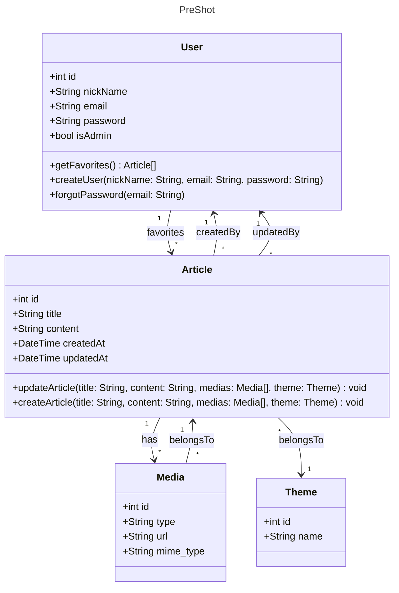

```mermaid
---
title: PreShot
---

classDiagram
    class User {
        +int id
        +String nickName
        +String email
        +String password
        +bool isAdmin
        +getFavorites() Article[]
        +createUser(nickName: String, email: String, password: String)
        +forgotPassword(email: String)
    }

    class Article {
        +int id
        +String title
        +String content
        +DateTime createdAt
        +DateTime updatedAt
        +updateArticle(title: String, content: String, medias: Media[], theme: Theme) void
        +createArticle(title: String, content: String, medias: Media[], theme: Theme) void
    }

    class Media {
        +int id
        +String type
        +String url
        +String mime_type
    }

    class Theme {
        +int id
        +String name
    }

    User "1" --> "*" Article : favorites
    Article "1" --> "*" Media : has
    Media "*" --> "1" Article : belongsTo
    Article "*" --> "1" Theme : belongsTo
    User "1" <-- "*" Article : createdBy
    User "1" <-- "*" Article : updatedBy
```