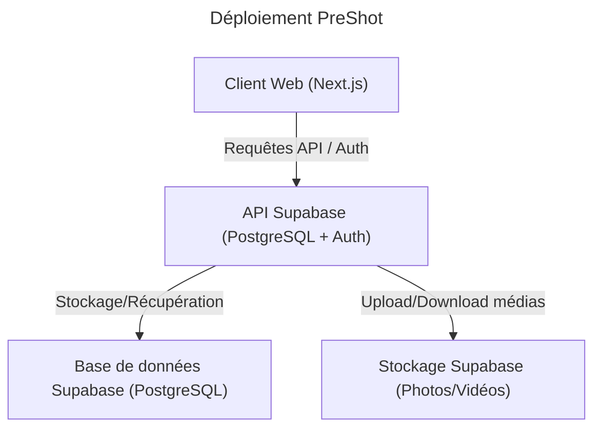

```mermaid
---
title: Déploiement PreShot
---

graph TD
    ClientWeb["Client Web (Next.js)"]
    SupabaseAPI["API Supabase (PostgreSQL + Auth)"]
    SupabaseDB["Base de données Supabase (PostgreSQL)"]
    SupabaseStorage["Stockage Supabase (Photos/Vidéos)"]

    ClientWeb -->|Requêtes API / Auth| SupabaseAPI
    SupabaseAPI -->|Stockage/Récupération| SupabaseDB
    SupabaseAPI -->|Upload/Download médias| SupabaseStorage


```